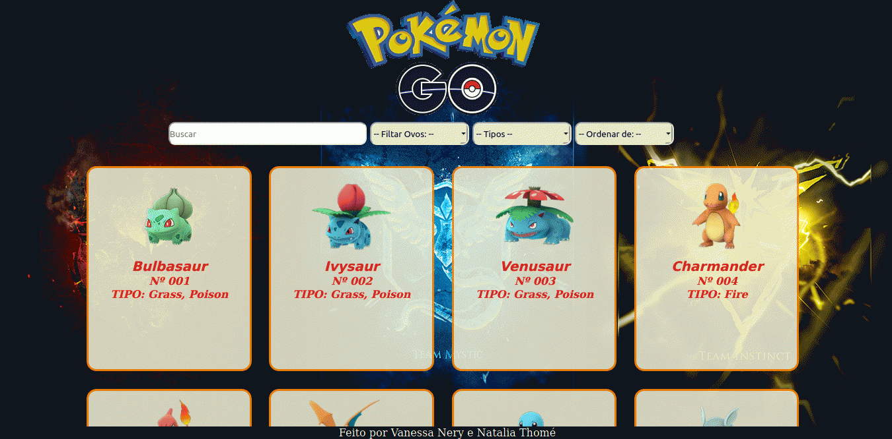

# Data Lovers

## Índice

* [1. O Projeto](#1-o-projeto)
* [2. Definição do Produto](#2-definição-do-produto)
* [3. Definição do Usuário](#3-definição-do-usuario)
* [4. História de Usuário](#4-historia-de-usuario)
* [5. Como Funciona](#5-como-funciona)
* [6. Como Utilizar](#6-como-utilizar)
* [7. Imagem do Site](#7-imagem-do-Site)
* [8. Link da nossa página](#8-link-da-nossa-página)
* [9. Checklist](#9-checklist)
* [10. Pessoas Envolvidas no Projeto](#10-pessoas-envolvidas-no-projeto)

***

## 1. O Projeto

Projeto proposto pela Laboratória, desenvolvido em dupla. Como produto final, entregamos uma pagina web para visualização de um conjunto de dados, com a possibilidade de filtrar, ordenar, buscar e traz um cálculo agregado. 

Tema escolhido: Pokémon.

## 2. Definição do Produto

Esse site foi desenvolvido com o objetivo de ajudar o jogador de Pokémon Go a ter acesso aos Pokémons existentes na região de Kanto. 
No jogo as informações sobre os Pokémons so são liberadas caso ele seja capturado. O nosso site traz, de uma maneira prática, uma lista com todos os Pokémons da região de kanto, auxiliando assim os jogadores de nível inicial e intermediário, Mostrando Pokémons filtrados por tipo, os que nascem em ovos e pelo tipo de ovo (2km, 5km e 10km), busca por nome e também possibilita o jogador ordená-los por nome de A-Z e de Z-A.

## 3. Definição do Usuário

Definimos os usuários a partir da criação de 2 personas:

## 4. História de Usuário

- Gustavo quer visualizar todos os Pokémons existentes.
- Quer filtrar por tipo.
- Quer saber quais são os pokémons que nascem em ovo.
- Quer visualizar os Pokémons por ordem alfabetica.
--------------------------------
- Gabriela quer saber quais pokémons nascer em um tipo especifico de ovo (2km, 5km ou 10km).
- Quer saber a porcentagem de pokémon pque nasce em ovo.
- Quer ver qual a porcentagem de pokémons por tipo.
- Quer realizar busca por nome.

## 5. Como Funciona

Mostrar Pokémons filtrados por tipo e os que nascem em ovos e pelo tipo de ovo (2km, 5km e 10km), busca por nome e também possibilita o jogador ordená-los por nome de A-Z e de Z-A.

## 6. Como Utilizar

Na barra de "Buscar" você pode escrever o nome do Pokémon com a primeira letra em maiúscula, ou caso saiba apenas parte do nome, a busca vai apresentar os pokémons que possuem as letras que você digitar.
No Filtro de Ovos vai apresentar os pokémons que nascem através do Ovos, você filtrar por Ovos de 2, 5 e 10 km.
No Filtro de Tipos apresenta os pokémons pelo tipo deles. Exemplo: Poison, vai apresenta Bulbasaur e suas evoluções.
No Filtro de "Ordenar" você consegue colocar em ordem alfabética, crescente e decrescente.

*Obs:. quando escolher o filtro de Ovos ou de Tipos, apresentar um calculo estatístico de quanto pokémons nascem através de ovos e quantos pokémons tem o tipo escohido.*

## 7. Imagem do Site

## 8. Link da nossa página

[Pokémon Go](https://vanesnery.github.io/SAP003-data-lovers/src/index.html)

## 9. Checklist

* [X] Usar VanillaJS.
* [X] Não utilizar `this`.
* [X] Passa pelo linter (`npm run pretest`)
* [X] Passa pelos testes (`npm test`)
* [X] Testes unitários cobrem um mínimo de 70% de statements, functions,
  lines e branches.
* [X] Inclui uma _definição de produto_ clara e informativa no `README.md`.
* [X] Inclui histórias de usuário no `README.md`.
* [X] Inclui rascunho da solução (protótipo de baixa fidelidade) no
  `README.md`.
* [X] Inclui uma lista de problemas detectados nos testes de usabilidade no `README.md`.
* [X] UI: Mostra lista/tabela/etc com dados e/ou indicadores.
* [X] UI: Permite ordenar dados por um ou mais campos (asc e desc).
* [X] UI: Permite filtrar dados com base em uma condição.
* [X] UI: É _responsivo_

## 10. Pessoas Envolvidas no Projeto

* Vanessa Nery (https://github.com/VanesNery)
* Natalia Thomé (https://github.com/NatThome)